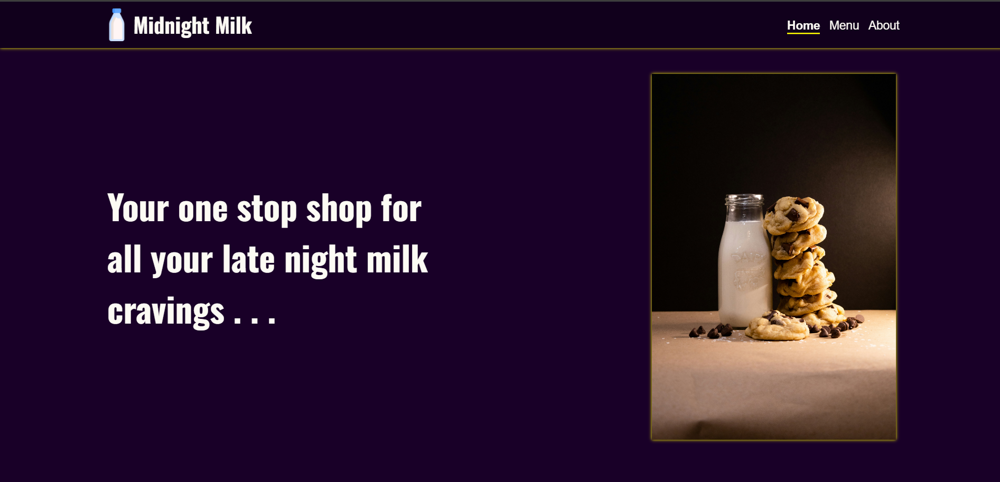
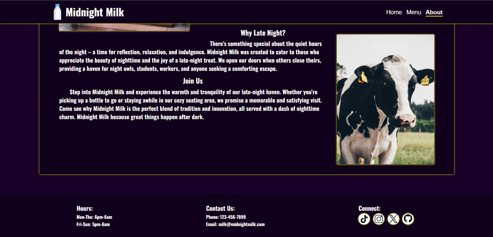

# restaurant-page

### Description

This purpose of this project was to exercise my knowledge in Webpack, npm and ES6 modules. I used webpack to bundle all of my files and assets along with webpack-dev-server for my development work flow.

The website itself is for a fictional restaurant called "Midnight Milk". I took inspiration from Isomnia Cookies for the theming, but the website itself is a bit random.

#### Live Website: https://hpagon.github.io/restaurant-page/

### Credits

- <a href="https://www.flaticon.com/free-icons/milk" title="milk icons">Milk icons created by Freepik - Flaticon</a>
- [Milk Picture by Reed Geiger](https://unsplash.com/photos/a-stack-of-cookies-next-to-a-bottle-of-milk-xZEthm6YX7g)
- <a href="https://www.flaticon.com/free-icons/motorcycle" title="motorcycle icons">Motorcycle icons created by kliwir art - Flaticon</a>
- <a href="https://www.flaticon.com/free-icons/3d-computer" title="3d computer icons">3d computer icons created by Freepik - Flaticon</a>
- <a href="https://www.flaticon.com/free-icons/verified" title="verified icons">Verified icons created by Freepik - Flaticon</a>
- <a href="https://www.flaticon.com/free-icons/instagram" title="instagram icons">Instagram icons created by Freepik - Flaticon</a>
- <a href="https://www.flaticon.com/free-icons/tiktok" title="tiktok icons">Tiktok icons created by Freepik - Flaticon</a>
- <a href="https://www.flaticon.com/free-icons/tweet" title="tweet icons">Tweet icons created by Freepik - Flaticon</a>
- [Milk icon <text x="0" y="115" fill="#000000" font-size="5px" font-weight="bold" font-family="'Helvetica Neue', Helvetica, Arial-Unicode, Arial, Sans-serif">Created by Evgeniy Artsebasov</text>
  <text x="0" y="120" fill="#000000" font-size="5px" font-weight="bold" font-family="'Helvetica Neue', Helvetica, Arial-Unicode, Arial, Sans-serif">from the Noun Project</text>](https://thenounproject.com/icon/milk-57415/)
- [Cow Picture by Oliver Augustijn](https://unsplash.com/photos/black-and-white-cow-on-green-grass-field-during-daytime-gnyDWQaxdEM?utm_content=creditShareLink&utm_medium=referral&utm_source=unsplash)
